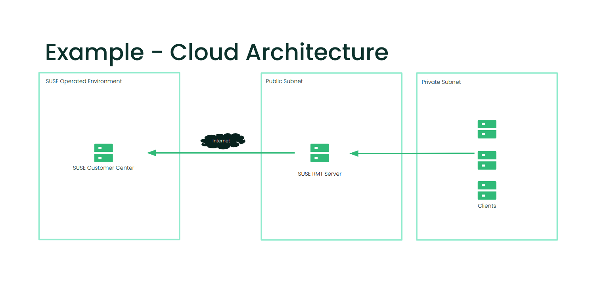

// This documentation was added to support the existing quickstart.
// https://documentation.suse.com/liberty/7/single-html/quickstart/index.html
// It is a suplement to Secton 2 and is/will be reference from that section.

// enable docinfo
:docinfo:

:sles: SUSE Linux Enterprise Server
:sccfull: SUSE Customer Center
= Deploy a {sles} instance to support RMT (Repository Mirroring Tool) on the Public Cloud

== About the guide

This document will walk you through the deployment of a simple {sles} instance operating on Amazon Web Services (AWS), Azure or Google Cloud Platform (GCP).

This instance can be used to support a deployment of RMT, which can be used to mirror updates from the {sccfull}.

An example of a cloud architecture for the deployment can be seen below, your deploymnet may look different depending on your networking standards:

This guide is split into the following sections:

* Using a BYOS image
* Registering the instance
* Considerations when using RMT

== Using a BYOS image
SUSE provides images for {sles} in AWS, Azure and GCP. They typically come in two flavours, PAYG (Pay As You Go), and BYOS (Bring Your Own Subscription).  These images are updated at regular intervals, so it is suggested to deploy new instances from the latest version of the image to ensure the most recent security updates are in place.
In order to support the use of RMT, it is recommended to deploy a {sles} instance from a BYOS image.

== Where to find the images in the Cloud Marketplace

When using Azure, {sles} BYOS images can be found in the Azure Marketplace. BYOS images have 'BYOS' in the name, the images with '24x7' are PAYG images.

image::azure-launch-sles-instance-cloud-rmt-marketplace.png[title=Azure Marketplace,scaledwidth=99%]

When using AWS, {sles} BYOS AMIs can be found in the AWS Marketplace, BYOS AMIs have 'byos' in the name.

image::aws-launch-sles-instance-cloud-rmt-marketplace.png[title=AWS Marketplace,scaledwidth=99%]

Consider using an m5.xlarge or similar (2-4 vcpu and 8GB RAM) as the instance type to support the RMT deployment.

// When using Google Cloud Platform ....

== Registering the Instance
After deployment, connect to the instance and register it with the SUSE Customer Center (SCC)

Example connection command for AWS, you will need to alter this for other cloud platforms.

----
ssh -i your_ssh_key ec2-user@server_ip
----

After launch, run the following command to register the SLES instance with the {sccfull}. The registration code is available by logging into the SCC and viewing available subscriptinos.

----
sudo SUSEConnect -e EMAIL_ADDRESS -r REGISTRATION_CODE
----

(Replace the email address and registration code with your values).

== Considerations when using RMT

=== Disk Space
The RMT server needs enough available disk space to mirror the SUSE Liberty Linux LTSS 7 repositories. Downloaded packages are stored in /var/lib/rmt/public/repo/. The amount of storage required depends on the number of repositories you mirror. We recommend at least 1.5 times the total size of all enabled repositories.

Best practice would be to provision an additional disk volume to support this requirement.

Mount the volume to '/var/lib/rmt/public/repo/' at instance creation, or immediately after launch.

In Azure this would be an additional volume, in AWS this would be an Amazon EBS volume. 
// In GCP ...

=== IP / Name Resolution
A static IP address or DNS name is required in order for clients to connect to RMT.

In Azure, AWS and GCP, a CSP provided DNS is assigned when the instance is launched, but this IP/DNS address may change if the instance is recreated for any reason.  

In Azure, consider using a static IP to provide a consistent connection point for your clients.
In AWS this would be an elastic IP or Route53.
// in GCP

=== Connectivity (RMT)
The RMT server will need connectivity to the SCC (SUSE Customer Center) over port 80 & 443. There are many ways to provide connectivity.

For example in AWS, depending on whether the RMT instance is in a Public or Private Subnet, connectivity to the SCC can be provided via an AWS Internet Gateway, an AWS NAT Gateway, or via a local datacenter (VPN/DX Connenction).

Azure and GCP will have similar services and concepts available.

=== Connectivity (Clients)
Clients connecting to RMT will need to do so over port 80 & Port 443.

When launching the {sles} instance to support RMT, check that the Network security group is configured to allow inbound access to the RMT server from your clients (HTTP / HTTPS).

When launching the {sles} instance to support RMT, it possible to use an existing AWS security group or create a new one.  Ensure that the security group is configured to allow inbound access to the RMT server from your clients (HTTP / HTTPS).

// ...

